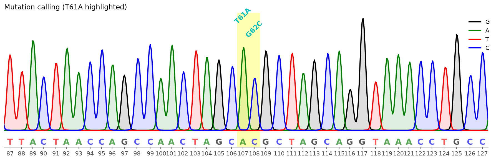
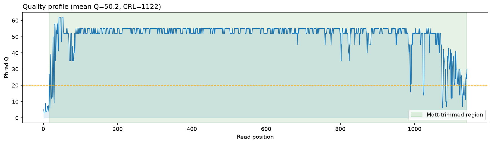
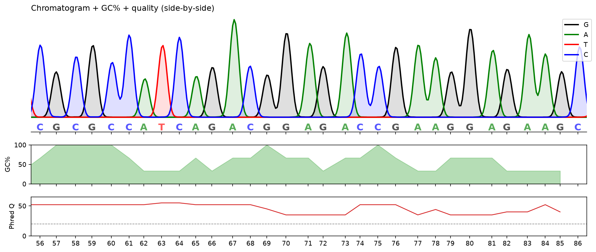
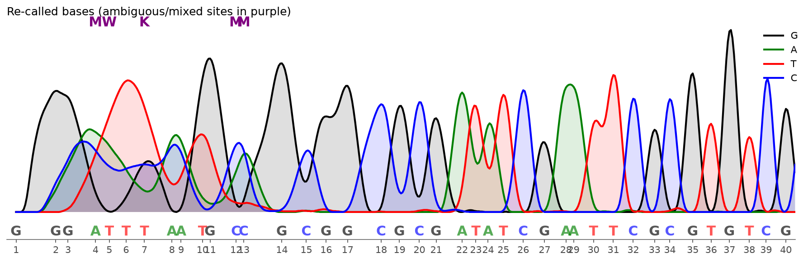
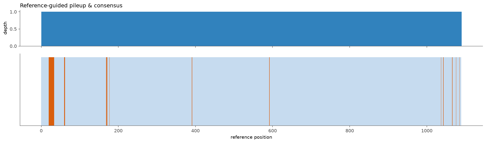

[](https://cfutils.readthedocs.io/en/latest/?badge=latest)
[](https://pypi.python.org/pypi/cfutils)
[](https://pepy.tech/project/cfutils)

**Chromatogram File Utils**

For Sanger sequencing data visualization, alignment, mutation calling, quality
control, base-calling, trimming, assembly and export — as a CLI, a Python
library, or an MCP server for LLM agents.

## Examples

The gallery below is generated from the bundled real ABI sample
(`data/B5-M13R_B07.ab1` vs `data/ref.fa`) by
`python -m scripts.make_readme_examples`.

### Mutation calling


Call and visualize variants (e.g. the SNP `T61A` highlighted above) against a
reference, with per-base quality-backed filtering.

### Quality control (quality profile, CRL, trimming)


The sample read is high-quality overall (mean Q 50.2, CRL 1122); the 5' start
and the 3' tail are trimmed by the Mott algorithm.

### Side-by-side panels (chromatogram + GC% + quality)


Add any extra signal (GC%, coverage, your own tool's output) aligned to the
same x-axis as the trace.

### Feature overlay (primers / amplicon / SNPs)


Annotate the trace with features; the DNA Features Viewer integration renders
a feature map above the chromatogram.

<details>
<summary>Re-called bases (mixed / heterozygous sites) & assembly</summary>

### Re-call bases from raw traces


Mixed peaks at the noisy 5' end are called as IUPAC ambiguity codes (M/W/K).

### Pileup & consensus


Reference-guided pileup (depth) and consensus for many overlapping reads.

</details>

## Quick start

The high-level [`Chromatogram`](#high-level-object-api) object is the easiest
way to work with the toolkit:

```python
from cfutils import Chromatogram, parse_fasta

cg = Chromatogram.from_abi("./data/B5-M13R_B07.ab1")
print(cg.length, cg.mean_quality, cg.gc_percent)   # 1141 50.2 52.0
print(cg.qc())                                     # QC metrics (CRL, SNR)

ref = parse_fasta("./data/ref.fa")
snps = cg.call_mutations(ref)                      # variant calling
print(cg.to_vcf(ref))                              # VCF of the variants
cg.plot(region=(55, 90))                           # render a region
```

Or from the command line (see [the CLI](#command-line-interface)).

## How to use?

- Mutation detection and visualization in one CLI step:

```bash
cfutils mut --query ./data/B5-M13R_B07.ab1 --subject ./data/ref.fa --outdir ./data/ --plot
```

- Or as a Python module:

```python
from cfutils import Chromatogram
cg = Chromatogram.from_abi("./data/B5-M13R_B07.ab1")
cg.plot()          # render the whole chromatogram
```


## How to install?

### lightweight core

The default install pulls only `numpy`, `click` and `rich-click` — no C
compiler and no plotting library required:

```bash
pip install cfutils
```

Parsing, QC, alignment (a bundled Cython Smith-Waterman with a NumPy fallback),
analysis and export all work out of the box — no external alignment library is
required.

### optional extras

```bash
pip install "cfutils[plot]"     # matplotlib -> chromatogram figures
pip install "cfutils[viewer]"   # DNA Features Viewer integration
pip install "cfutils[agent]"    # MCP server for LLM agents
pip install "cfutils[all]"      # everything
```

The bundled Cython Smith-Waterman accelerator (`cfutils._swalign`, self-contained,
no ssw dependency) is compiled automatically when a C compiler is present at
build time and used transparently; otherwise the NumPy fallback is used.

### from source

```bash
git clone git@github.com:y9c/cfutils.git
cd cfutils
make init       # install dependencies
make test       # run the test-suite
```

## ChangeLog

- Reverse completement the chromatogram file. (Inspired by Snapgene)
- build as python package for pypi
- fix bug that highlighting wrong base
- replace blastn with buildin python aligner
- add `features` module: dna-features-viewer style feature overlay API
- add `quality` module: tunable quality-score filtering (was hard-coded in plot)
- add `tracks` module: split / join / slice chromatogram trace files
- add `assembly` module: multi-read pileup + consensus calling
- add `composite` module: side-by-side plotting with external tools
- add `center_region` + fix `highlight_base` end-boundary bug in `show`
- add `basecaller` module: re-call bases from raw four-channel traces
- add `qc` module: per-read QC metrics + batch summaries
- add `transform` module: public Mott `trim` (keeps traces/peaks aligned) + `reverse_complement_record`
- add `utils.normalize_ambiguity` (IUPAC handling)
- fix false-positive mutations from lowercase reference bases (case-insensitive compare)
- add `dnalink` module: plot cfutils chromatograms together with DNA Features Viewer
- expose `parse_abi(rescale=...)`; base/peak analysis requires `rescale=False`
- add `analysis` module: translate, motif/restriction-site scan, sliding GC
- add `export` module: FASTA / VCF / JSON / batch summary
- add heterozygote (mixed-base) calling to `basecaller`
- add `trim_ends` / `strip_primers` to `transform`
- rich-click CLI UX: themed command groups, option groups, short options, `--version`

## Command-line interface

The CLI is built on `rich-click` and organised into themed groups (see
`cfutils --help`):

```text
cfutils mut            mutation calling & reporting
cfutils qc             per-read quality-control metrics
cfutils track          split / join / slice chromatogram trace files
cfutils edit           trim, strip primers, reverse-complement
cfutils basecall       re-call bases from raw four-channel traces
cfutils assemble       reference-guided pileup & consensus
cfutils analyze        sequence biology (translate, motifs, restriction)
cfutils export         FASTA / VCF / JSON / batch summary
cfutils plot           chromatogram rendering (+ features / DNA viewer)
```

Examples:

```bash
cfutils mut -q read.ab1 -s ref.fa -o out --plot        # mutation report + figure
cfutils qc r1.ab1 r2.ab1                                # QC table
cfutils track split read.ab1 -c 20,40 -f tsv            # split traces
cfutils edit trim read.ab1 -c 0.05 -o out               # Mott quality trim
cfutils edit strip-primers read.ab1 -f AAAA -r CCCA     # primer removal
cfutils basecall call read.ab1 -r 0.45                  # re-call bases
cfutils basecall hetero read.ab1                        # mixed/heterozygous sites
cfutils assemble consensus a.ab1 b.ab1 -r ref.fa        # reference-guided consensus
cfutils analyze rest read.ab1                           # restriction sites
cfutils analyze translate read.ab1 -f 1                 # protein translation
cfutils export vcf -q read.ab1 -s ref.fa                # VCF of variants
cfutils export batch *.ab1 -o out -f csv                # batch QC table
cfutils plot dnaviewer read.ab1 --start 50 --end 100    # with DNA Features Viewer
```

## Python API

Most examples use the high-level [`Chromatogram`](#high-level-object-api) object.
Low-level modules remain available for custom work.

```python
from cfutils import Chromatogram, parse_fasta

cg = Chromatogram.from_abi("./data/B5-M13R_B07.ab1")
ref = parse_fasta("./data/ref.fa")
```

### Mutation calling & quality filtering
```python
from cfutils.quality import QualityFilter

snps = cg.call_mutations(ref)                     # variants vs reference
confident = QualityFilter(min_base_qual=20, min_local_qual=20).filter(snps)
print([f"{s.ref_base}{s.ref_pos}{s.cf_base}" for s in confident])
```

### QC metrics (incl. continuous read length)
```python
m = cg.qc()
print(m["mean_qual"], m["trim_start"], m["trim_end"], m["crl"], m["snr"])
```

### Re-call bases from raw traces + mixed/heterozygous sites
```python
res = cg.basecall()
print(res.sequence)
for pos, major, minor, frac in res.heterozygotes(min_ratio=0.2):
    print(pos, major, minor, frac)
```

### Trim / strip primers / reverse-complement
```python
trimmed  = cg.trim().trim_leading_ns()
stripped = cg.trim()                       # Mott quality trim (trace-aligned)
rc       = cg.reverse_complement()
```

### Automatic orientation detection
```python
ori = cg.detect_orientation(ref)           # +1 forward, -1 reverse-complement
```

### Sequence-level analysis
```python
print(cg.analyze("translate", frame=1))            # protein translation
print(cg.analyze("restriction"))                    # restriction sites -> {'EcoRI': [27], ...}
print(cg.analyze("motif", motif="AATT"))            # motif positions
```

### Export to standard formats
```python
print(cg.to_fasta())                                # FASTA
print(cg.to_vcf(ref))                               # VCF of variants
cg.export("out")                                    # write FASTA to disk
```

### Feature overlay (for external tools)
```python
from cfutils import ChromatogramFeature

cg2 = Chromatogram.from_abi("./data/B5-M13R_B07.ab1")
feat = ChromatogramFeature(start=90, end=130, strand=+1, label="primer F")
fig, ax = cg2.plot(region=(80, 140))                # high-level plot
from cfutils.features import plot_features
plot_features(cg2.to_record, ax, features=[feat])   # overlay
```

### Side-by-side with another tool's output (shared x-axis)
```python
from cfutils.composite import side_by_side

def my_panel(ax, trace_x, peaks, seq, record, start=None):
    ax.bar(range(len(seq)), [1.0]*len(seq), color="0.66")
    ax.set_ylabel("my tool signal")

fig, (ax_chrom, ax_panel) = side_by_side(cg.to_record, my_panel, region=(10, 40))
```

### Consensus / assembly from many reads
```python
from cfutils import parse_abi
from cfutils.assembly import pileup, consensus

reads = [parse_abi(f) for f in ["a.ab1", "b.ab1", "c.ab1"]]
table = pileup(reads, ref, quality_threshold=20)
print(consensus(table))
```

### Plot together with DNA Features Viewer
```python
from cfutils import ChromatogramFeature
from cfutils.dnalink import plot_combined

feats = [ChromatogramFeature(start=90, end=130, strand=+1, label="primer F")]
fig, (ax_feat, ax_chrom) = plot_combined(cg.to_record, features=feats, region=(55, 90))
```
Requires the optional extra: `pip install cfutils[viewer]` (i.e. `dna-features-viewer`).

### Split / join trace files
```bash
cfutils track join a.ab1 b.ab1 --outbase joined --outdir out/
cfutils track split a.ab1 --cuts 20,40 --outdir out/
cfutils track slice a.ab1 --start 1 --end 200 --outdir out/
```

## Agent / MCP (agent-friendly)

cfutils ships a [Model Context Protocol](https://modelcontextprotocol.io) server so
LLM agents and MCP clients can call the toolkit as tools:

```bash
pip install "cfutils[agent]"     # adds mcp>=2
cfutils-mcp                        # run the MCP server over stdio
python -m cfutils.mcp_server       # identical
```

The server exposes these tools (each returns JSON-serialisable data):

| Tool | Purpose |
|---|---|
| `read_chromatogram(path)` | parse an ABI → summary (length, GC%, quality, CRL) |
| `qc_metrics(path)` | full per-read QC metrics (incl. CRL, signal, SNR) |
| `call_mutations(query ab1, subject fa)` | variants vs a reference (SNPs/indels) |
| `re_call_bases(path)` | re-call bases from raw traces + heterozygotes |
| `analyze_sequence(path, kind)` | translate / motifs / restriction / GC |
| `trim_read(path, mode)` | quality-trim a read |
| `export_sequence(path, outdir)` | write FASTA or VCF |
| `plot_chromatogram(path, out, start, end)` | render a chromatogram PNG |

Register it in an MCP client's config, e.g.:

```json
{ "mcpServers": { "cfutils": { "command": "cfutils-mcp" } } }
```

## High-level object API

Wrap everything in one object for a terse, idiomatic workflow:

```python
from cfutils import Chromatogram
from cfutils.parser import parse_fasta

cg = Chromatogram.from_abi("./data/B5-M13R_B07.ab1")

print(cg.length, cg.mean_quality, cg.gc_percent, cg.channels)  # 1141 50.2 52.0 GATC
print(cg.qc())                                    # QC metrics incl. CRL / SNR
res = cg.basecall()                               # re-call bases from raw traces

ref = parse_fasta("./data/ref.fa")
snps = cg.call_mutations(ref)                     # variant calling
print(cg.to_vcf(ref))                             # VCF export
print(cg.analyze("restriction"))                  # restriction-site scan

fig, ax = cg.plot(region=(55, 90))                # render a region
trimmed = cg.trim().trim_leading_ns()             # Mott trim then drop leading Ns
```

## TODO

- [x] call mutation by alignment and plot Chromatogram graphic
- [x] add a doc
- [x] change xaxis by peak location
- [x] fix bug that chromatogram switch pos after trim (trace-aligned slicing)
- [x] wrap as a cli app
- [x] return quality score in output (quality module + report)
- [x] fix issue that selected base is not in the middle (center_region)
- [x] fix plot_chromatograph rendering bug (full-region bounds, channels)
- [x] add projection feature to make align and assemble possible (assembly module)
- [x] preserve trimmed-origin positions when slicing/joining (offset provenance)
