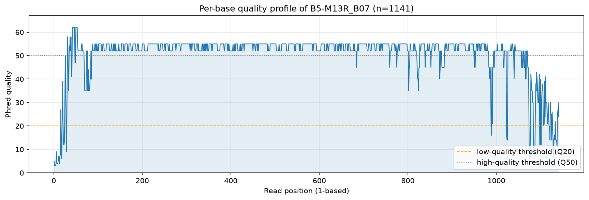
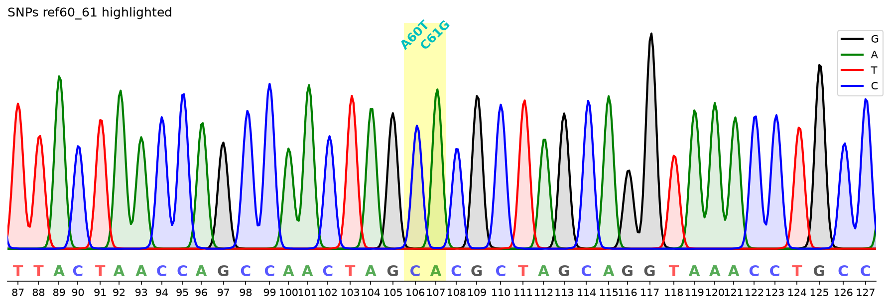
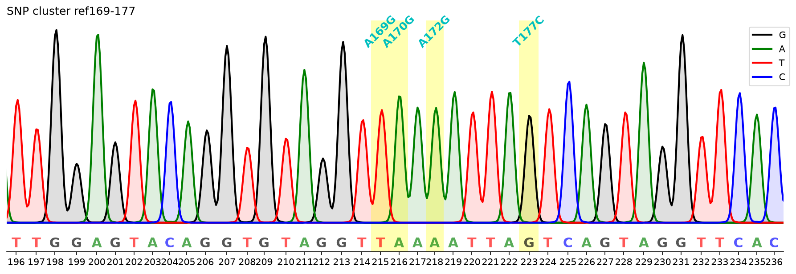
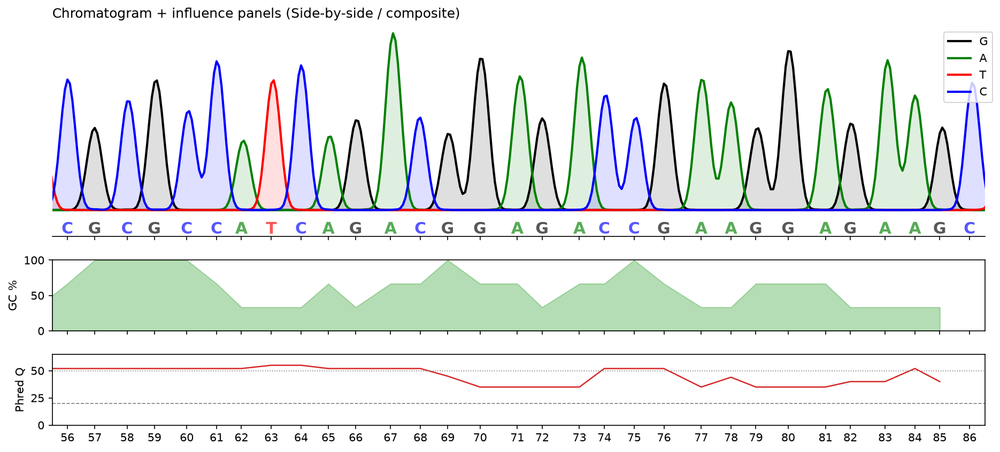
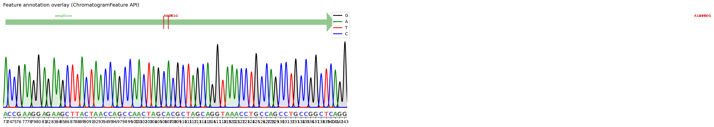
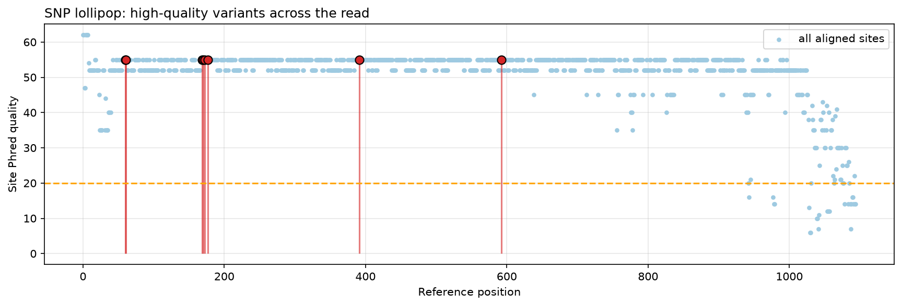
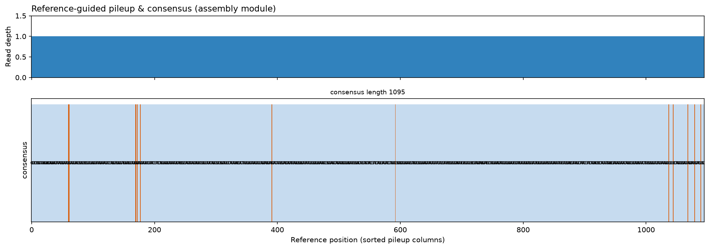
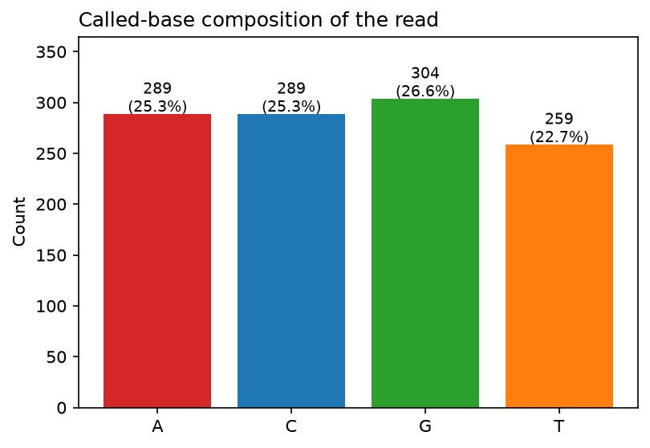
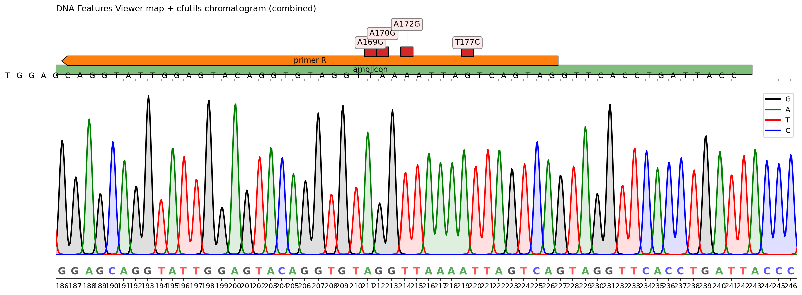
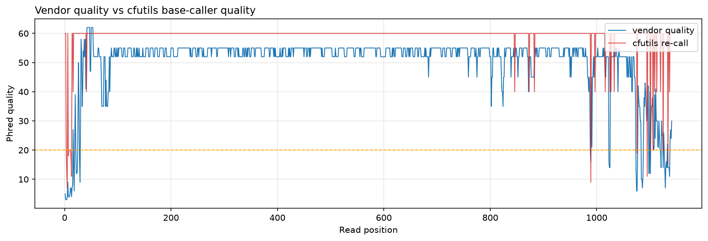

# Analysis of a real Sanger trace

This page walks through the full cfutils pipeline on the bundled real data
(`data/B5-M13R_B07.ab1` vs `data/ref.fa`), generated by
`python -m scripts.generate_report`.

## Sample summary

| Metric | Value |
|---|---|
| Read name | `B5-M13R_B07` |
| Called bases | 1141 |
| Mean Phred quality | 50.2 |
| Min Phred quality | 3 |
| N fraction | 0.0% |
| Low-quality (<Q20) fraction | 4.1% |
| Mott-trimmed interval | 16–1140 (1125 bp) |
| Reads aligned to ref | 1095 |
| Base-caller re-call accuracy | 99.1% (n=1141) |
| Mean re-called quality | 59.1 |
| Quality-filtered, real SNPs | 8 |

## Results

The read is high-quality overall (mean Q50); the dye
primers degrade at the 3' end (see the quality profile).  A python re-call from
the raw four-channel traces reproduces the vendor base call with
**99.1%** accuracy.  Comparing against the reference, **8**
high-confidence single-nucleotide variants are called:

| Ref pos | Change | Site Q | Local Q |
|---|---|---|---|
| 60 | A→T | 55 | 53 |
| 61 | C→G | 55 | 54 |
| 169 | A→G | 55 | 54 |
| 170 | A→G | 55 | 54 |
| 172 | A→G | 55 | 55 |
| 177 | T→C | 55 | 55 |
| 391 | G→A | 55 | 55 |
| 592 | A→C | 55 | 53 |

## Figures

### Per-base quality profile

The 5' ~30 bp and 3' tail drop below Q20, while the interior is Q50+.

### Variant chromatograms
Mutations called by alignment are highlighted and annotated on the trace.

### Side-by-side (composite) plotting
Chromatogram with GC% and per-base quality panels sharing the same x axis —
this is how external tools can plot their own signal alongside cfutils.

### Feature overlay API

### SNP lollipop

### Pileup & consensus (assembly)

### Base composition

### DNA Features Viewer integration

The same chromatogram rendered together with a
[DNA Features Viewer](https://github.com/Edinburgh-Genome-Foundry/DnaFeaturesViewer)
feature map (top) and the called sequence, sharing one x axis.

### Base-caller benchmark

A Python re-call of the raw four-channel traces reproduces the vendor base call
with **99.1%** accuracy (mean Q59).

> Figures auto-generated; re-run `python -m scripts.generate_report` to refresh.
